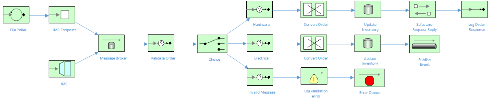

# Order Fulfillment Routes in Fuse 7.x

This project is centered around an order fulfillment system for a hardware retailer.  Orders are consumed by Fuse from either a File or JMS-based interface, validated then processed according to their category.  Each order request is then individually transformed into an order fulfillment message, then transferred to the corresponding system for processing.

Part of the project is implemented in Fuse by a Developer.  The remaining implementation should be completed by a *Citizen Integrator* in Fuse Online.  That way, both Developer's and Citizen Integrator's can collaborate to create a holistic integration solution.

The Camel routes used in this example are explained by the following diagram:



## Prerequisite installation steps

### Setup Fuse Online

1.  Create a new Fuse Online OpenShift project using `oc new-project fuse-online`
2.  Download the Fuse Online install script by executing `wget https://raw.githubusercontent.com/syndesisio/fuse-online-install/1.4/install_ocp.sh`
3.  Create the CRD using the following command: `oc get crd`.
4.  Run the CRD install script using the following command: `bash install_ocp.sh --setup`
5.  Install Fuse Online using this command: `bash install_ocp.sh`

### Setup OpenShift Project

1. Via the CLI, create a new project for the deployment: `oc new-project order-fulfillment`

### Import Fuse Image Streams

1. Login via the CLI as the cluster admin
1. Run the following command to import the image streams:

	```bash
	BASEURL=https://raw.githubusercontent.com/jboss-fuse/application-templates/application-templates-2.1.fuse-710017-redhat-00006
	oc create -n openshift -f ${BASEURL}/fis-image-streams.json
	```

1. Install the quickstart templates

	```bash
	for template in eap-camel-amq-template.json \
	 eap-camel-cdi-template.json \
	 eap-camel-cxf-jaxrs-template.json \
	 eap-camel-cxf-jaxws-template.json \
	 eap-camel-jpa-template.json \
	 karaf-camel-amq-template.json \
	 karaf-camel-log-template.json \
	 karaf-camel-rest-sql-template.json \
	 karaf-cxf-rest-template.json \
	 spring-boot-camel-amq-template.json \
	 spring-boot-camel-config-template.json \
	 spring-boot-camel-drools-template.json \
	 spring-boot-camel-infinispan-template.json \
	 spring-boot-camel-rest-sql-template.json \
	 spring-boot-camel-teiid-template.json \
	 spring-boot-camel-template.json \
	 spring-boot-camel-xa-template.json \
	 spring-boot-camel-xml-template.json \
	 spring-boot-cxf-jaxrs-template.json \
	 spring-boot-cxf-jaxws-template.json ;
	 do
	 oc create -n openshift -f \
	 https://raw.githubusercontent.com/jboss-fuse/application-templates/application-templates-2.1.fuse-710017-redhat-00006/quickstarts/${template}
	 done
	 ```

1.  Install the Fuse Console into the `openshift` and `order-fulfillment` namespaces:

	```bash
	oc create -n openshift -f https://raw.githubusercontent.com/jboss-fuse/application-templates/application-templates-2.1.fuse-710017-redhat-00006/fis-console-cluster-template.json
	oc create -n openshift -f https://raw.githubusercontent.com/jboss-fuse/application-templates/application-templates-2.1.fuse-710017-redhat-00006/fis-console-namespace-template.json
	oc create -n order-fulfillment -f https://raw.githubusercontent.com/jboss-fuse/application-templates/application-templates-2.1.fuse-710017-redhat-00006/fis-console-cluster-template.json
	oc create -n order-fulfillment -f https://raw.githubusercontent.com/jboss-fuse/application-templates/application-templates-2.1.fuse-710017-redhat-00006/fis-console-namespace-template.json
	```

### Setup Postgres Database

1. Open a browser window and navigate to your OpenShift web console.

1. Click on the `order-fulfillment` project.

1. Click on **Browse Catalog**, then navigate to the **Databases** menu and select **Postgres**.  From there, select the **PostgreSQL** (Ephemeral) template.

    

1. In the pop-up window that appears, click the **Next** button to reach the **Configuration** page.  Update **PostgreSQL Connection Username** to `dbuser` and **PostgreSQL Connection Password** to `password`.

    

1. Click **Next** and ensure *Do not Bind at this time* is selected.  Click **Create** to generate the service.

1. Navigate to **Services**, locate the *postresql* Service, then create a route.

### Setup AMQ 6.3 Broker

1.  Using the same `order-fulfillment` project, execute the following via the CLI:

	```bash
	echo '{"kind": "ServiceAccount", "apiVersion": "v1", "metadata": {"name": "amqsa"}}' | oc create -f -
	```
1. Add the view role to the SA:

	```bash
	oc policy add-role-to-user view system:serviceaccount:order-fulfillment:amqsa
	```
1. Execute the following command from the local order-fulfillment directory:

	```bash
	oc secrets new amq-app-secret src/main/resources/broker.ks src/main/resources/broker.ts
	```

1. Navigate back to the OCP web console and Click "Add to Project".  Select the *Middleware > Integration* tab, then select the **JBoss AMQ 6.3 (Ephemeral with SSL)** icon.

1. On the configuration page, enter `openwire,amqp` as the **A-MQ Protocols**.  Enter `admin` for the **A-MQ Username** and **A-MQ Password**.  Enter `topsecret` for the **Trust Store Password** and **A-MQ Keystore Password**.  Click through the rest of the pages, but ensure **Do not bind at this time** is selected.

1. Once the broker has started, navigate to Services and create a route for the `broker-amq-tcp-ssl` service.  Ensure to secure the route with 'Passthrough' SSL termination.

### Setup AMQ Streams (Kafka) Broker

1. Download and unzip the following file: `https://access.redhat.com/node/3596931/423/1`
1.  Via the CLI, execute the following command (on MacOS):

	```bash
	sed -i '' 's/namespace: .*/namespace: order-fulfillment/' install/cluster-operator/*RoleBinding*.yaml
	```
1. Deploy the Cluster Operator:

	```bash
	oc apply -f install/cluster-operator -n order-fulfillment
	oc apply -f examples/templates/cluster-operator -n order-fulfillment
	```

1. Deploy the Kafka Cluster:

	```bash
	oc apply -f examples/kafka/kafka-ephemeral.yaml
	```
	
1. Via the CLI, test the cluster using the sample producer / consumer clients in separate windows, whilst replace the `cluster-name-kakfa-bootstrap` with your corresponding service name:

	```bash
	oc run kafka-producer -ti --image=registry.access.redhat.com/amqstreams-1/amqstreams10-kafka-openshift:1.0.0 --rm=true --restart=Never -- bin/kafka-console-producer.sh --broker-list cluster-name-kafka-bootstrap:9092 --topic my-topic
	```
	
	```bash
	oc run kafka-consumer -ti --image=registry.access.redhat.com/amqstreams-1/amqstreams10-kafka-openshift:1.0.0 --rm=true --restart=Never -- bin/kafka-console-consumer.sh --bootstrap-server cluster-name-kafka-bootstrap:9092 --topic my-topic --from-beginning
	```
	
### Install Eclipse Che

1. Via the CLI, create a new project for the deployment: `oc new-project tools1`
1. From the support/install/ansible directory, execute the following command: `ansible-playbook -i inventory/che.inventory playbooks/openshift/install.yml`
1. Via the OCP Web Console, monitor the startup of Eclipse Che.  Once the pod starts, click on the route link to open up the IDE

### Setup Consolidated Fuse Console on OpenShift

For management purposes, it can benefical to monitor and manage all running instances of your application.  To do this, follow these steps:

1. Via the OCP console, navigate to the `order-fulfillment` project.
1. Via the **Add to Project** drop-down, select **Browse Catalog**.
1. In the Search window search for `Fuse Console`.
1. Select the Fuse Console template (the non-clustered one), accept all defaults and create the deployment.
1. Once the Fuse Console pod has started, click on the link to open the consolidated console.

## Build & Run

### Running locally

1.  Update the `src/main/resources/application.properties` with the new AMQ route hostname

	```bash
	# AMQ broker properties
	activemq.broker.url=failover://ssl://broker-amq-tcp-ssl-order-fulfillment.apps.lowes-7031.openshiftworkshop.com:443
	```
	
1.  Via the CLI, type `oc get pods` to display the running pods.  Copy the pod name for the `postgresql` service.

1. Enable port forwarding of the postgres service by typing the following via the CLI (but replacing the pod name): `oc port-forward <postgres pod> 5432`.

1. Via the command-line, you should be able to run this project locally using mvn, and it should work as expected:

	```bash
	mvn spring-boot:run
	```

## Running on OpenShift

Once you have your OpenShift environment configured, we can deploy the `order-fulfillment` project using the standard s2i principals..

1.  Via the OCP Web Console, navigate to the *Add to Project* drop-down and select **Import YAML / JSON**.
2.  Copy the contents of `https://raw.githubusercontent.com/sigreen/order-fulfillment/master/support/templates/order-fulfillment.json` to the import window.
3.  Click **Create** to kick-off the s2i build.

If you would like to deploy using s2i binary streams from your IDE, you can also run the follow commands from the CLI:

	```bash
	oc project order-fulfillment
	mvn -Pocp
	```
	
## Building out Fuse Online Routes

### Scenario One: Hardware Fulfillment

Build out an integration that:

1. Consumes messages for the `hardware.fulfillment` AMQ queue
1. Enriches the message with a description located in the STOCK database.  The SQL is: `select * from STOCK where item_name = :#itemName`
1. Transforms the message into a JSON [message](src/main/resources/fulfillment.json)
1. Sends the generated JSON message to the Order Fulfillment AMQ queue `outgoing.fulfillment`.

### Scenario Two: Electrical Fulfillment

Build out an integration that:

1. Consumes messages for the `electrical.fulfillment` AMQ queue
1. Enriches the message with a description located in the STOCK database.  The SQL is: `select * from STOCK where item_name = :#itemName`
1. Transforms the message into a JSON [message](src/main/resources/fulfillment.json) and capitalizes the `itemName` field.
1. Sends the generated JSON message to the Kafka topic `My.Topic`.

